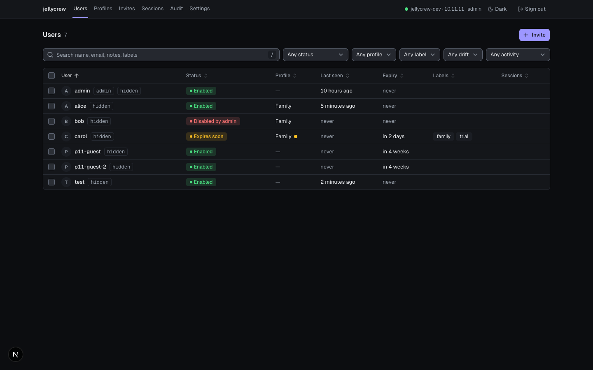
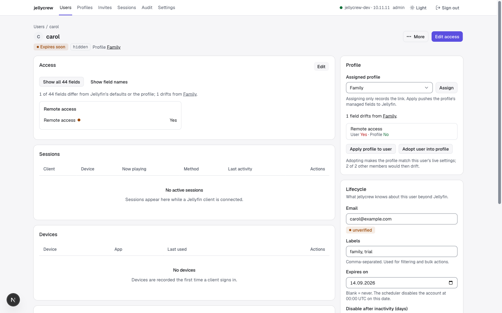
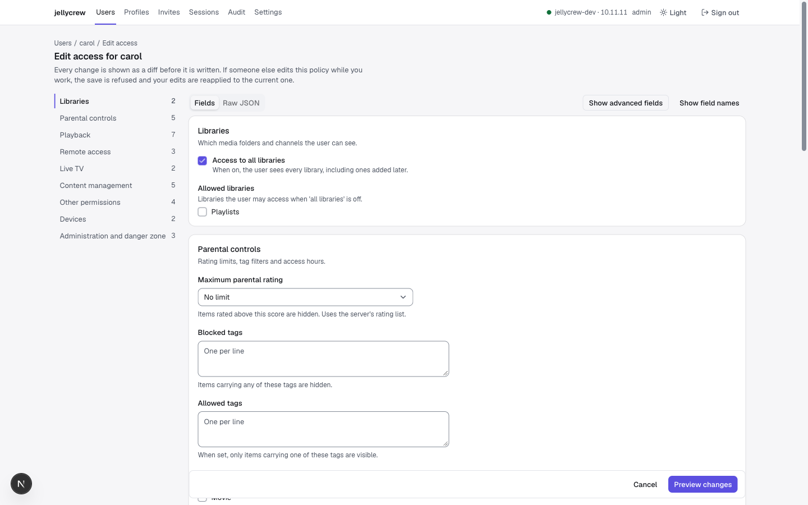
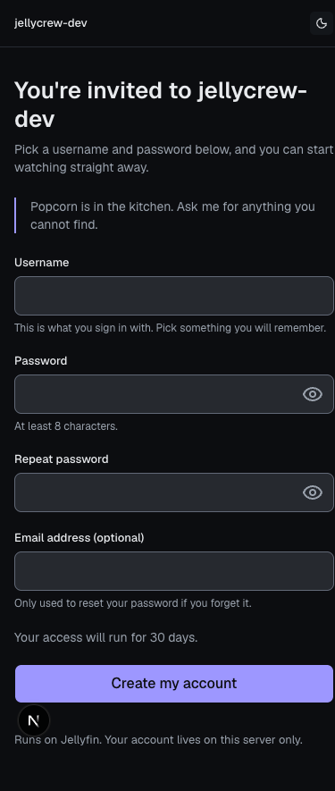

<div align="center">

# jellycrew

**Self-hosted user management for a single [Jellyfin](https://jellyfin.org) server.**

<p>
<a href="https://github.com/rurudev/jellycrew/actions/workflows/ci.yml"></a>
<a href="https://github.com/rurudev/jellycrew/actions/workflows/release.yml"></a>
<a href="https://github.com/rurudev/jellycrew/pkgs/container/jellycrew"></a>
<a href="LICENSE"></a>

</p>

</div>

jellycrew replaces the Jellyfin dashboard for everything about people: who has access, to what, on
what terms, for how long, and what they are watching right now. It is one container, one SQLite
file and one API key.

Jellyfin stays the source of truth for users, policies, sessions, devices and libraries. jellycrew
owns only what Jellyfin cannot: profiles, lifecycle rules, invites, contact details, reset tokens
and an audit trail.



[Why](#why) · [Features](#features) · [Preview](#preview) · [Install](#install) ·
[Configuration](#configuration) · [Security](#security) · [Backup](#backup-and-restore) ·
[Upgrading](#upgrading) · [Development](#development) · [Support](#support) ·
[Contributing](#contributing) · [License](#license)

## Why

Jellyfin's own user management assumes you set a policy once and forget it. If you run a server for
family and friends, you end up doing the same work by hand over and over: repeating the same forty
settings for each new account, remembering who was supposed to lose access in March, sending
someone a password because there is no way for them to reset it, and having no record of what you
changed last month.

jellycrew adds exactly that layer and nothing else. It does not transcode, index or stream
anything, and it never stores a password of its own.

## Features

- **Users.** One filterable table with status (enabled, disabled by you, disabled by automation
  with the reason, expiring, scheduled for deletion), profile and drift, last seen, labels and live
  sessions. Select several and act on them with a per-user preview and per-user results.
- **Access.** Every `UserPolicy` field in plain language, grouped, with the raw field name one
  toggle away and a JSON fallback for the rest. A save shows the diff first and refuses a write
  that lost a race with somebody else's.
- **Profiles.** Reusable sets of policy fields: create one blank, from a user's current settings or
  by copying another. Assign it, apply it, or adopt a user's settings back into it. Drift is shown
  per field, and applying to every member previews each one.
- **Lifecycle.** Expiry dates, inactivity rules inherited from the profile, two-step deletion
  (disabled now, removed after a grace period), and a scheduler that runs every fifteen minutes and
  audits everything it does.
- **Invites.** A link with an expiry, a number of uses, a profile and a note. The guest picks their
  own username and password; if the profile cannot be applied, the account is rolled back.
- **Self-service.** `/me` lets people change their own password, confirm an email address, see
  where they are signed in and sign a device out. `/reset` mails a single-use link, and you can
  hand one over yourself when there is no mail server.
- **Audit.** Every write, by you, by a guest, by an invite or by the scheduler, with before and
  after values, filters and CSV or JSON export.

**Safeguards.** Administrators are never touched by automation or bulk actions. The last enabled
administrator and the account you are signed in as cannot be disabled, demoted or deleted.
Destructive actions ask you to type the name. Deleting is two steps, and the audit log is
append-only.

Tested against Jellyfin **10.11.11**; the interface warns you when the live server runs a different
minor version.

## Preview

### One person's page



What differs from the profile or from Jellyfin's defaults comes first, so you read two lines
instead of forty-four. Sessions, devices and history sit below; the profile, the lifecycle rules
and the facts sit beside them.

### The access editor



Forty-four fields with help text, a jump list, and a diff before anything is written.

### What a guest sees



An invite link carries the server's name, not the tool's. One column, large controls, a password
field that can be revealed, and a finished signup that ends with the server address to paste into
the app.

## Install

You need a Jellyfin server, somewhere to run one container, and an API key from *Jellyfin →
Dashboard → API Keys → +*.

```bash
docker run -d --name jellycrew -p 3000:3000 -v jellycrew-data:/data \
  -e JELLYFIN_URL=http://192.168.1.10:8096 \
  -e JELLYFIN_API_KEY=your-api-key \
  -e PUBLIC_BASE_URL=http://localhost:3000 \
  -e SESSION_SECRET="$(openssl rand -hex 32)" \
  ghcr.io/rurudev/jellycrew:latest
```

Open `http://localhost:3000` and sign in with any Jellyfin administrator account — jellycrew has
none of its own. The database migrates itself on first start; a bad environment stops the container
and the log names the variable. The image is published for `linux/amd64` and `linux/arm64`.

`JELLYFIN_URL` is Jellyfin as the container reaches it, so use the host's address rather than
`localhost`.

### Docker Compose

To run jellycrew next to Jellyfin, start from [`docker-compose.example.yml`](docker-compose.example.yml):

```bash
cp docker-compose.example.yml docker-compose.yml
# fill in JELLYFIN_API_KEY, PUBLIC_BASE_URL and SESSION_SECRET
docker compose up -d
```

Either way you deploy it, read [Security](#security) before it is reachable from anywhere but your
LAN.

## Configuration

| Variable | Required | Purpose |
| --- | --- | --- |
| `JELLYFIN_URL` | yes | Jellyfin as the container reaches it, e.g. `http://jellyfin:8096` |
| `JELLYFIN_API_KEY` | yes | Administrator API key. Never logged, never sent to the browser |
| `PUBLIC_BASE_URL` | yes | Where guests reach jellycrew; it builds invite and reset links |
| `SESSION_SECRET` | yes | 32 or more random characters; signs cookies and seals stored invite links |
| `DATA_DIR` | no | Where `app.db` lives; `/data` in the image |
| `SMTP_URL` | no | `smtp://` or `smtps://`; turns on verification and reset mail |
| `SMTP_FROM` | with SMTP | Sender address |
| `LOG_LEVEL` | no | `fatal` to `trace`, default `info` |

Everything else is a setting inside the app, so changing it needs no restart. A copy of the table
is in [`.env.example`](.env.example).

## Security

One container serves two audiences:

- **The console** (`/`, `/users`, `/profiles`, `/sessions`, `/invites`, `/audit`, `/settings`,
  `/login`) requires a Jellyfin administrator session, and belongs on an address that only resolves
  on your LAN or VPN. Do not publish it.
- **The guest paths** (`/invite/*`, `/reset*`, `/me*`, `/api/public/*`, `/healthz` and the static
  assets) are all a guest needs, and the only ones worth publishing.

Guest endpoints are rate-limited per IP and per token inside the app. Session cookies are `HttpOnly`
and `SameSite=Lax`, and `Secure` whenever `PUBLIC_BASE_URL` is `https`. Console sessions last twelve
hours, guest sessions thirty days.

If guests have to reach it from the internet, put a reverse proxy or tunnel in front of it and route
only the guest paths there. The example compose file publishes port 3000 as-is, so give it a
LAN-only bind address (`"192.168.1.10:3000:3000"`) when nothing else is standing in front.

The API key has full administrator rights over your Jellyfin server, so treat the console hostname
as privileged and keep it off the public internet. If you find a vulnerability, please report it
privately through GitHub's security advisories rather than opening a public issue.

## Backup and restore

All state is `app.db` in the `/data` volume (plus `app.db-wal` and `app.db-shm` while it runs).

```bash
docker compose exec jellycrew node -e "require('better-sqlite3')('/data/app.db').backup('/data/backup.db').then(()=>console.log('ok'))"
docker compose cp jellycrew:/data/backup.db ./jellycrew-$(date +%F).db
```

Or stop the container and snapshot the volume. Restore by putting the file back as `/data/app.db`,
removing any stale `-wal` and `-shm` files, and starting again. Losing the database loses profiles,
invites, lifecycle settings and the audit log; the users themselves live in Jellyfin and are
untouched. Keep `SESSION_SECRET` with the backup: stored invite links are sealed with it.

## Upgrading

Back up, pull the new image, `docker compose up -d`. Migrations run at start and there is no
downgrade path, so keep that backup until the new version has proven itself. When the pinned
Jellyfin version changes, the generated client is regenerated and a test fails if `UserPolicy`
gained or lost a field, so an upgrade that would silently drop a setting cannot pass.

## Development

Node 22, pnpm 12, and Docker for the integration tests, which start real Jellyfin and Mailpit
containers.

```bash
pnpm install
pnpm jellyfin:dev   # a disposable Jellyfin 10.11 on :8096; writes .env.local if it is missing
pnpm dev            # http://localhost:3000, sign in as admin / admin-password-1
```

```bash
pnpm test           # unit and integration
pnpm test:unit
pnpm test:integration
pnpm lint && pnpm typecheck
pnpm build
pnpm ops:check      # builds the image and checks its health against Jellyfin in compose
pnpm db:generate    # after editing lib/db/schema.ts
pnpm jellyfin:gen   # regenerate the OpenAPI snapshot and client
```

**Layout.** `app/` routes, as server components and server actions. `components/` the interface.
`lib/services/` the only code that talks to Jellyfin, and it audits every write. `lib/policy/` pure
policy logic: the field catalogue, merge, diff and the protection rules. `lib/lifecycle/` the
scheduler's decision function. `tests/integration/` container-backed tests. `drizzle/` migrations.

**Documents.** [`DESIGN.md`](DESIGN.md) is the interface system as shipped: tokens, components and
the patterns that repeat. [`DECISIONS.md`](DECISIONS.md) records every design and architecture
decision, one line each, in the order they were made. [`SPEC.md`](SPEC.md) is what the app is meant
to do. `docs/design/` holds the audit, direction and plan behind the current interface, and
`docs/audit-*.md` the security and data-layer audits. `AGENTS.md` describes the stack for coding
agents.

## Support

- Read [`SPEC.md`](SPEC.md), [`DECISIONS.md`](DECISIONS.md) and `docs/` first: most "why is it like
  this" questions are answered there.
- Bugs and feature requests go to [GitHub Issues](https://github.com/rurudev/jellycrew/issues).
  Please include your Jellyfin version and what the interface reported.

## Contributing

Issues and pull requests are welcome. Before opening a pull request:

- `pnpm lint && pnpm typecheck && pnpm test` should pass. Integration tests need Docker.
- Anything that touches Jellyfin goes through `lib/services/` and records an audit entry.
- Anything that changes the interface follows `DESIGN.md`, and adds a line to `DECISIONS.md`
  explaining why.
- Keep the two audiences apart: the console is dense and keyboard-driven, the guest pages are one
  column and say as little as possible.

## License

[GNU Affero General Public License v3.0 or later](LICENSE). Run it, change it and pass it on; if you
offer a changed version to other people over a network, offer them its source too. Running the
published image unmodified asks nothing of you.

jellycrew is an independent project and is not affiliated with or endorsed by the Jellyfin project.
